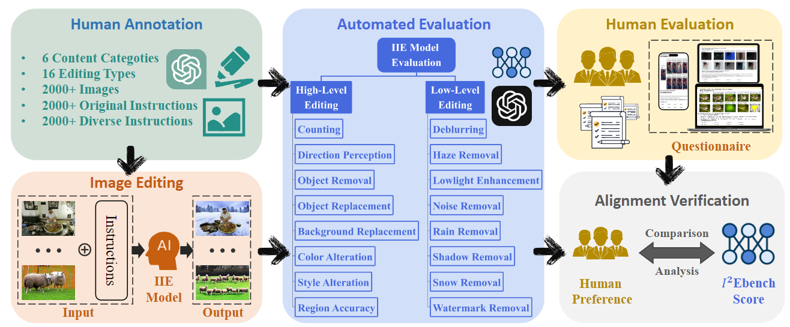
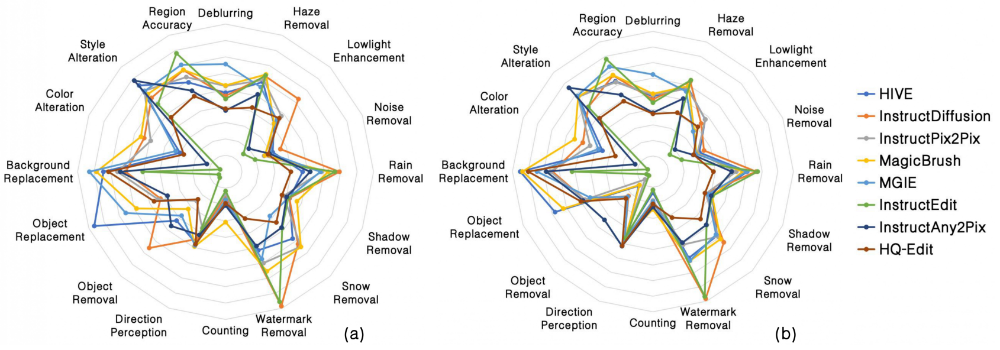
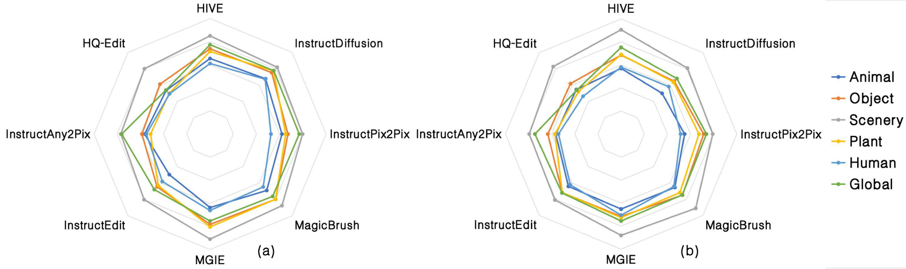

# I²EBench

[](https://arxiv.org/abs/2408.14180)    [](https://drive.google.com/drive/folders/1RzeIaWjVHAofZAXmEPm3XcrfSdQCO5-q?usp=drive_link)

> [**I²EBench: A Comprehensive Benchmark for Instruction-based Image Editing**](https://arxiv.org/abs/2408.14180)  
>
> Yiwei Ma, Jiayi Ji, Ke Ye, Weihuang Lin, Zhibin Wang, Yonghan Zheng, Qiang Zhou, Xiaoshuai Sun, Rongrong Ji

## :mag:Overview



Overview of **I²EBench**, an automated system for evaluating the quality of editing results generated by instruction-based image editing (IIE) models. We collected a dataset of over 2000+ images from public datasets and annotated them with corresponding original editing instructions. To diversify the instructions, we used ChatGPT to generate varied versions. With the collected images and the original/diverse editing instructions, we utilized existing IIE models to generate edited images. Subsequently, we developed an evaluation methodology to automatically assess the adherence of edited images to the provided instructions under different dimensions. We also implemented human evaluation to obtain human preferences for editing results of different IIE models. Finally, we analyzed the correlation between automated evaluation and human evaluation, confirming alignment with human perception.

## :bar_chart:Evaluation Results



+ Comparison of radar charts for I²EBench scores in different dimensions using (a) original instructions and (b) diverse instructions.



+ Comparison of radar charts for I²EBench scores in different categories using (a) original instructions and (b) diverse instructions. The scores of all dimensions are normalized and averaged.

## :file_folder:Folder Detail

```
.
└── EditBench
    ├── EditData				### dataset with different dimensions
    │   ├── BGReplacement
    │   ├── ColorAlteration
    │   ├── Counting
    │   ├── Deblurring
    │   ├── DirectionPerception
    │   ├── HazeRemoval
    │   ├── Lowlight
    │   ├── NoiseRemoval
    │   ├── ObjectRemoval
    │   ├── RainRemoval
    │   ├── RegionAccuracy
    │   ├── Replacement
    │   ├── ShadowRemoval
    │   ├── SnowRemoval
    │   ├── StyleAlteration
    │   └── WatermarkRemoval
    ├── EditEval			    ### 1. with `diverse` editing instructions
    						   ### 2. evaluation results of 8 editing models(any2pix,
    						   ### hive,hqedit,iedit,instruct-diffusion,instructpix2pix,
    						   ### magicbrush,mgie) in every dimensions.
    │   ├── BGReplacement        # including evaluation results of 8 editing models
    │   ├── ColorAlteration      # including evaluation results of 8 editing models
    │   ├── Counting             # ...
    │   ├── Deblurring
    │   ├── DirectionPerception
    │   ├── HazeRemoval
    │   ├── Lowlight
    │   ├── NoiseRemoval
    │   ├── ObjectRemoval
    │   ├── RainRemoval
    │   ├── RegionAccuracy
    │   ├── Replacement
    │   ├── ShadowRemoval
    │   ├── SnowRemoval
    │   ├── StyleAlteration
    │   └── WatermarkRemoval
    ├── EditEval_ori        	 ### 1. with `original` editing instructions
    						   ### 2. evaluation results of 8 editing models(any2pix,
    						   ### hive,hqedit,iedit,instruct-diffusion,instructpix2pix,
    						   ### magicbrush,mgie) in every dimensions.
    │   ├── BGReplacement        # including evaluation results of 8 editing models
    │   ├── ColorAlteration      # including evaluation results of 8 editing models
    │   ├── Counting             # ...
    │   ├── Deblurring
    │   ├── DirectionPerception
    │   ├── HazeRemoval
    │   ├── Lowlight
    │   ├── NoiseRemoval
    │   ├── ObjectRemoval
    │   ├── RainRemoval
    │   ├── RegionAccuracy
    │   ├── Replacement
    │   ├── ShadowRemoval
    │   ├── SnowRemoval
    │   ├── StyleAlteration
    │   └── WatermarkRemoval
    ├── EditRank			    ### 1. with `diverse` editing instructions
    						   ### 2. rank results of 8 editing models(any2pix,
    						   ### hive,hqedit,iedit,instruct-diffusion,instructpix2pix,
    						   ### magicbrush,mgie) in every dimensions based on evaluation results
    │   ├── BGReplacement.json    # rank results of 8 editing models
    │   ├── ColorAlteration.json  # rank results of 8 editing models
    │   ├── Counting.json         # ...
    │   ├── Deblurring.json
    │   ├── DirectionPerception.json
    │   ├── HazeRemoval.json
    │   ├── Lowlight.json
    │   ├── NoiseRemoval.json
    │   ├── ObjectRemoval.json
    │   ├── RainRemoval.json
    │   ├── RegionAccuracy.json
    │   ├── Replacement.json
    │   ├── ShadowRemoval.json
    │   ├── SnowRemoval.json
    │   ├── StyleAlteration.json
    │   └── WatermarkRemoval.json
    ├── EditRank_ori			### 1. with `original` editing instructions
    						   ### 2. rank results of 8 editing models(any2pix,
    						   ### hive,hqedit,iedit,instruct-diffusion,instructpix2pix,
    						   ### magicbrush,mgie) in every dimensions based on evaluation results
    │   ├── BGReplacement.json    # rank results of 8 editing models
    │   ├── ColorAlteration.json  # rank results of 8 editing models
    │   ├── Counting.json         # ...
    │   ├── Deblurring.json
    │   ├── DirectionPerception.json
    │   ├── HazeRemoval.json
    │   ├── Lowlight.json
    │   ├── NoiseRemoval.json
    │   ├── ObjectRemoval.json
    │   ├── RainRemoval.json
    │   ├── RegionAccuracy.json
    │   ├── Replacement.json
    │   ├── ShadowRemoval.json
    │   ├── SnowRemoval.json
    │   ├── StyleAlteration.json
    │   └── WatermarkRemoval.json
    ├── EditResult			 	### 1. with `diverse` editing instructions
    						   ### 2. editing results of 8 editing models(any2pix,
    						   ### hive,hqedit,iedit,instruct-diffusion,instructpix2pix,
    						   ### magicbrush,mgie) in every dimensions based on evaluation results
    │   ├── BGReplacement
    │   ├── ColorAlteration
    │   ├── Counting
    │   ├── Deblurring
    │   ├── DirectionPerception
    │   ├── HazeRemoval
    │   ├── Lowlight
    │   ├── NoiseRemoval
    │   ├── ObjectRemoval
    │   ├── RainRemoval
    │   ├── RegionAccuracy
    │   ├── Replacement
    │   ├── ShadowRemoval
    │   ├── SnowRemoval
    │   ├── StyleAlteration
    │   └── WatermarkRemoval
    ├── EditResult_ori           ### 1. with `original` editing instructions
                                 ### 2. editing results of 8 editing models(any2pix,
                                 ### hive,hqedit,iedit,instruct-diffusion,instructpix2pix,
                                 ### magicbrush,mgie) in every dimensions based on evaluation results
    │   ├── BGReplacement
    │   ├── ColorAlteration
    │   ├── Counting
    │   ├── Deblurring
    │   ├── DirectionPerception
    │   ├── HazeRemoval
    │   ├── Lowlight
    │   ├── NoiseRemoval
    │   ├── ObjectRemoval
    │   ├── RainRemoval
    │   ├── RegionAccuracy
    │   ├── Replacement
    │   ├── ShadowRemoval
    │   ├── SnowRemoval
    │   ├── StyleAlteration
    │   └── WatermarkRemoval
    ├── eval_scripts                                 ### scripts for evaluation
    │   ├── high_level_eval_stage1.py			    ## evaluation for high-level dimensions, e.g. BGReplacement.
                                                     # stage1: using LVLM(e.g. GPT4V) to ask edited images
                                                     #         questions(from jsons in `EditData`), get the
                                                     #         raw `VLM_judgement` outputs, saved in `EvalData`
    │   ├── high_level_eval_stage2_final_judge.py    # stage2: using LLM(e.g. GPT4-turbo) with designed template
                                                     #         to get the more stable `final_judgement`
    │   ├── low_level_eval.py                        ## evaluation for low-level dimensions, e.g. Deblurring
    │   ├── metrics_utils                            ## utils for evaluations, e.g. GPT4V, GPT4-turbo, CLIP, SSIM
    │   ├── sample_rank_gen.py                       ## generate script for `EditRank_ori` and `EditRank`
    │   ├── summary.json                             ## generated by `summary.py`
    │   ├── summary_ori.json                         ## generated by `summary.py`
    │   ├── summary.py                               ## generate script for `summary.json` and `summary.json`,
                                                     #  describe metric scores for every models in every dimensions
    │   ├── summary_model_type_avg_score.json        ## generated by `summary_model_type_avg_score.py`
    │   └── summary_model_type_avg_score.py          ## generate script for `summary_model_type_avg_score.json`,
                                                     # describe metric scores for every editing models
                                                     # in every dimensions
    └── readme.md

```

# 🤔How to evaluate with my own editing model

[Check how to evaluate with my own editing model](./HOW_TO_EVAL.md)


# :pen: Citation

```
@inproceedings{ma2024i2ebench,
  title={I2EBench: A Comprehensive Benchmark for Instruction-based Image Editing},
  author={Ma, Yiwei and Ji, Jiayi and Ye, Ke and Lin, Weihuang and Zheng, Yonghan and Zhou, Qiang and Sun, Xiaoshuai and Ji, Rongrong and others},
  booktitle={The Thirty-eighth Annual Conference on Neural Information Processing Systems},
  year={2024}
}
```
